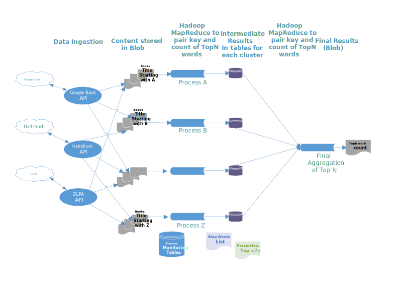

# Word Count Design Approach for list TopN words from books in the Digital Libraries

## Logical architecture diagram

##
## Key Design Considerations

1. **What factors do you have to take into consideration? What tradeoffs do you make?**
	- Maximum storage account capacity
	- Given large volume of data, in order to scale, we will do the parallel processing of word count compute
	- Synchronization of the parallel compute
	- Compute will be in the batch mode and not in real time.
2. **How do you handle such a huge volume of data?**
	- Store books retrieved from the digital library in separate buckets/partitions for the distributed processing in parallel
        - In this case, suggestion is to bucketize using tile starting with 'A',  'B"...'Z' stored on separate storage accounts
	- Delete file(the book) as soon as it is processed (meaning TopN word count compute for it is done)
3. **What components such a platform would have?**
	- Assuming Azure Cloud platform
		- Blob storage accounts - A to Z.
		- HDInsight clusters (Hadoop / MapReduce Framework) - A to Z
		- Function App Service Plan for hosting 
			- Data ingestion functions with REST API calls (Java)
			- Script(s) to invoke HDInsight MapReduce Jobs (PowerShell)
		- Azure Queue to trigger data ingestion functions
		- Azure SQL or MySQL database to host process monitoring and intermediate results tables for each cluster 
		- Azure Monitor/Application Insights
		- AzureDevOps/GitHub for the application code.
4. **How would those components interact with each other to solve your problems?**
	-  A trigger file placed by the user (with user's email), initiates programs (Java based) to invoke various rest API calls to start download of books in a loop from the digital libraries to the blob storage
	-  As it completes each download, it makes an entry in database table serving as the queue to proces the file and monitor file process status 
	-  A PowerShell script (Azure function) for each cluster monitoring the queue, pickups next book to process on its clusters and invoke MapReduce job (Java)
	-  The MapReduce job
		- Reads TopN parameter value from the parameter file
		- Reads and cache Stop word list from the stop word list
		- Reads data (books) from the blob storage
		- Filters out the "Stop" word
		- Generates mapping (Token, count)
		- Summarizes to produce mapping (Token, count) 
		- Updates the local topN count table for its cluster
		- Updates the global table serving as the process monitoring queue
		- Deletes the processed file (the book) from the storage
	- When the final aggregation process, monitoring the global table, detects that there are no more files to process, then 
		- It invokes program (java based) to read indeterminate results from each cluster's table and produce final results in an output file 
		- Sends the email notification to the user with link to the output file
		- Removes the trigger file placed by user to stop further processing. 
5. **How would the programmer and user interact with it? What kind of abstractions would you build?**
	- Inputs
		- User will input/specify top N word parameter in the file in a blob storage 
		- User will input/specify "stop" words to be filtered in the stop world list file in a blob storage 
		- Use will place a trigger file in a blob storage to kick-off the word count process
	- Output
		- An output text file will be created listing top N worlds
		- User will be notified via an email with the link to the output file 
	- Abstractions
		- Java classes to read & write to/from storage
		- Parameterize PowerShell scripts to invoke MapReduce job
		- Parameterize java program for extracting data using REST API
		- Provision/Deprovision the platform components, as the code
6. **What kind of SLA guarantees you can provide or not to provide?**
	- Since this a batch data processing and not a real time analysis use case - SLA would be in Hours ( could be a day or two) 
	- For more real time analysis needs, we can use spark (with word count program in Scala) instead of MapReduce to speed up computation but it has cost implications 
7. **What enterprise concerns that the platform should address for enterprises like KO to embrace it?**
	- Cost effective to provision 
	- Provisioning and Deprovisioning of platform components on demand. 
	- Observability through application/platform logs
	- Nice to have, integration with Azure AD for the data security
8. **How would you make sure your word counts are in fact accurate?**
	- Test the program with a one or two small files with a short one or two paragraphs and a short list of stop words
        - Verify the results with manual calculations.
9. **Are there any out of the box patterns, utilities or libraries that you will leverage?**
	- Pattern	
		- MapReduce
		- Graceful exit through exception handling 
		- Restart capability through checkpoints
	- Libraries
		- java.io.IOException;
		- java.util.StringTokenizer;

		- org.apache.hadoop.conf.Configuration;
		- org.apache.hadoop.fs.Path;
		- org.apache.hadoop.io.IntWritable;
		- org.apache.hadoop.io.Text;
		- org.apache.hadoop.mapreduce.Job;
		- org.apache.hadoop.mapreduce.Mapper;
		- org.apache.hadoop.mapreduce.Reducer;
		- org.apache.hadoop.mapreduce.lib.input.FileInputFormat;
		- org.apache.hadoop.mapreduce.lib.output.FileOutputFormat;	
		- org.apache.hadoop.util.GenericOptionsParser;

